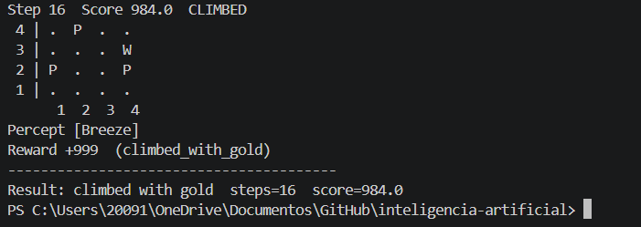

# Ejercicio 1

## Agentes Inteligentes

### Diseño original del mapa del wumpus

```yaml
grid:
  width: 4
  height: 4

agent:
  start: [1, 1]
  direction: east
  arrows: 1

wumpus: [1, 3]

pits:
  - [3, 1]
  - [3, 3]
  - [4, 4]

gold: [2, 3]
```
### Esta es la estrucura original del mapa.

```yaml
 4 | .  .  .  P 
 3 | W  G  P  . 
 2 | .  .  .  . 
 1 | >  .  P  . 
      1  2  3  4
```

### Una vez cambiada la estructura original del mapa, así es como quedaría la con la configuración actual en un mapa 4x4.

``` yaml
grid:
  width: 4
  height: 4

agent:
  start: [1, 1]
  direction: east
  arrows: 1

wumpus: [4, 3]

pits:
  - [4, 2]
  - [1, 2]
  - [2, 4]

gold: [3, 4]
```
### Esta es como luce la estrucuta nueva
``` yaml
 4 | .  P  G  . 
 3 | .  .  .  W 
 2 | P  .  .  P 
 1 | >  .  .  . 
      1  2  3  4
```

#### Una vez realizado estos cambios, probaremos su comportamiento en los diferentes agentes

## 02_simple_reflex_agent

