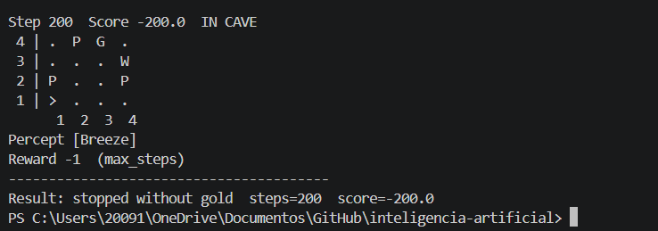
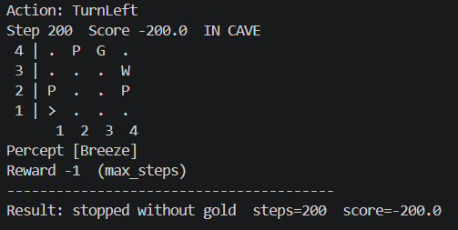
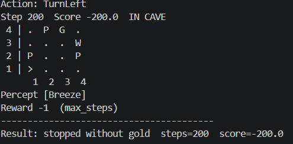
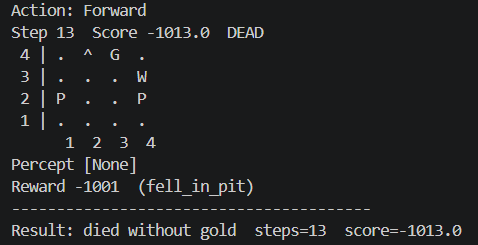
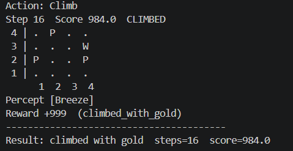

# Ejercicio 1

## Agentes Inteligentes

### Diseño original del mapa del wumpus

```yaml
grid:
  width: 4
  height: 4

agent:
  start: [1, 1]
  direction: east
  arrows: 1

wumpus: [1, 3]

pits:
  - [3, 1]
  - [3, 3]
  - [4, 4]

gold: [2, 3]
```
### Esta es la estrucura original del mapa.

```yaml
 4 | .  .  .  P 
 3 | W  G  P  . 
 2 | .  .  .  . 
 1 | >  .  P  . 
      1  2  3  4
```

### Una vez cambiada la estructura original del mapa, así es como quedaría la con la configuración actual en un mapa 4x4.

``` yaml
grid:
  width: 4
  height: 4

agent:
  start: [1, 1]
  direction: east
  arrows: 1

wumpus: [4, 3]

pits:
  - [4, 2]
  - [1, 2]
  - [2, 4]

gold: [3, 4]
```
### Esta es como luce la estrucuta nueva
``` yaml
 4 | .  P  G  . 
 3 | .  .  .  W 
 2 | P  .  .  P 
 1 | >  .  .  . 
      1  2  3  4
```

#### Una vez realizado estos cambios, probaremos su comportamiento en los diferentes agentes

## 02_simple_reflex_agent



## 03_Model_Based_agent



## 04_Goal_based_agent




## 05_Utility_based_agent



## 06_Learning_agent



# Reporte de resultados     

   - Qué agentes lograron salir con el oro en tu mapa y cuáles no?

    El unico que logro salir fue el agente basado en aprendizaje.
    El resto quedaron detenidos si el oro (simple, model,goal)
    El utility based agent murio sin el oro.


   - ¿Por qué el **agente de reflejo simple** falla (o tiene suerte) en tu diseño?

    Falla porque se encuentra muy lejos de la zona [1,1]. Al estar mas lejos, las habilidades para poder llegar son limitadas, 
    haciendo que usé todas sus posibilidades antes de acercarce al oro. En mi diseño simplemente no llegó debido a que había un pit,
    cerca de [1,1], especificamente en [1,2], lo que hacia es que el agente no se pudiera mover y giraba, lo que ocasiona que choque con la
    pared, haciendo que entre en un loop, ya que no recuerda por donde pasó.

   - ¿Cómo cambia el resultado del **agente basado en modelo** si acercas o alejas un pit de la casilla inicial?

    Al acercar un pit a [1,1], hace que el agente sienta el breeze, e inmediatamente relaciona el [1,2] y [2,1] como posibles pits, lo que
    hace que se quede en un loop y se quede sin intentos.
