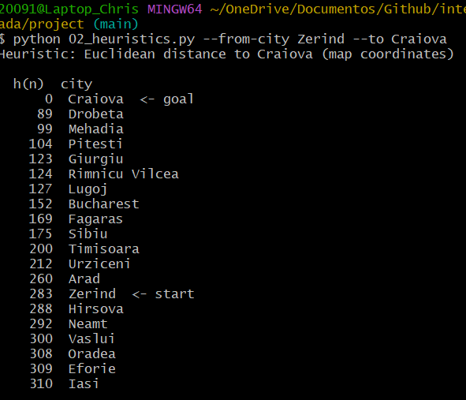
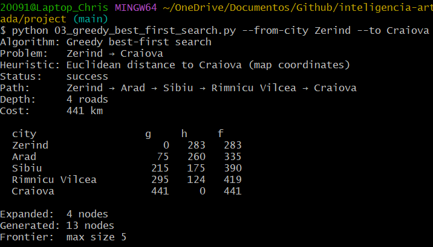
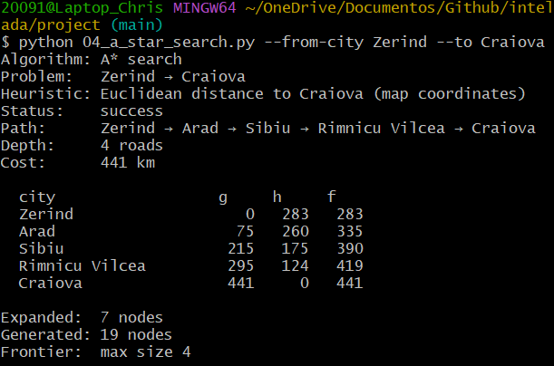

# Ejercicio 1: Análisis de Algoritmos de Búsqueda Informada

### Objetivo
Elegir una ruta distinta de Arad → Bucharest, inspeccionar h(n), correr Greedy y A*, y analizar diferencias de camino, costo, profundidad y nodos expandidos a la luz de g, h y f.


### Pareja seleccionada

**Zerind → Craiova** 


**Subgrafo**
```Texto
[Zerind] (h=283) ──75 km──> [Arad] (h=260) ──140 km──> [Sibiu] (h=175) ──80 km──> [Rimnicu Vilcea] (h=124) ──146 km──> [Craiova] (h=0)
```

### Cálculo de Heurísticas

A continuación se presenta el resultado del calculo de la Heuristicas de Zerind a Craiova.



### Ejecutar Greedy Best First Search




### Ejecutar A* Start Search



### Tabla comparativa de **g/h/f**


| Ciudad ($n$) | $g(n)$ (Costo Real) | $h(n)$ (Estimado a Craiova) | $f(n) = g(n) + h(n)$ |
| :--- | :---: | :---: | :---: |
| **Zerind** | 0 km | 283 km | 283 km |
| **Arad** | 75 km | 260 km | 335 km |
| **Sibiu** | 215 km | 175 km | 390 km |
| **Rimnicu Vilcea** | 295 km | 124 km | 419 km |
| **Craiova** | 441 km | 0 km | 441 km |

*En este caso ambos algoritmos encontraron la misma ruta para llegar a Craiova*

### Tabla comparativa de resultados de Algoritmos

| Algoritmo | Status | Path | Depth | Cost (km) | Expanded | Generated | Heurística Usada |
| :--- | :---: | :--- | :---: | :---: | :---: | :---: | :--- |
| **Greedy Best-First** | `Success` | Zerind → Arad → Sibiu → Rimnicu Vilcea → Craiova | 4 Roads | 441 km | 4 Nodes | 13 Nodes | Euclidiana a Craiova |
| **A* Search** | `Success` | Zerind → Arad → Sibiu → Rimnicu Vilcea → Craiova | 4 Roads | 441 km | 7 Nodes | 19 Nodes | Euclidiana a Craiova |

*En el caso de esta pareja de ciudades se utilizo como metrica los valores de las Heuristicas generados ya que el destino no era Bucharest*

