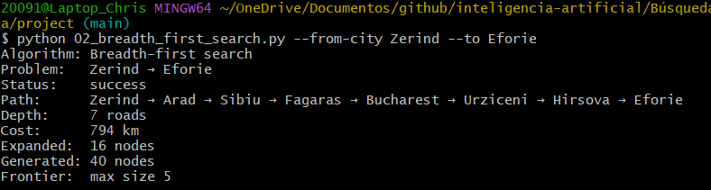
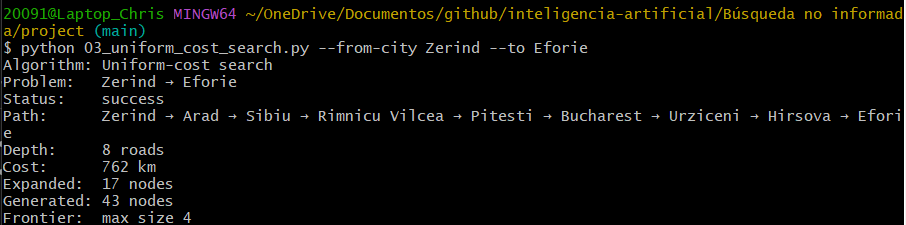
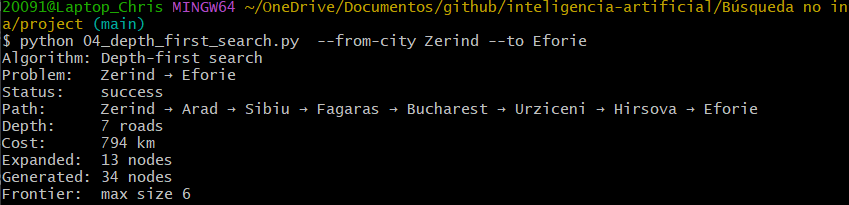
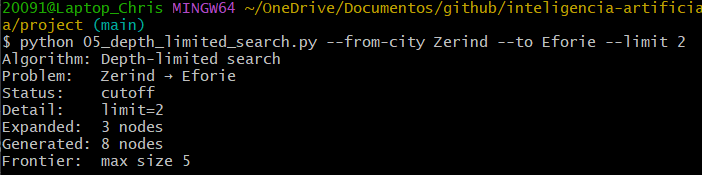
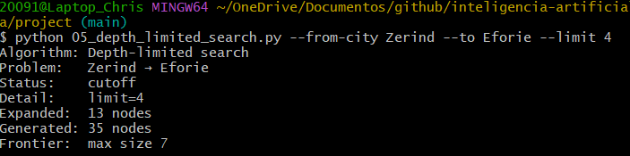
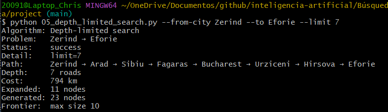
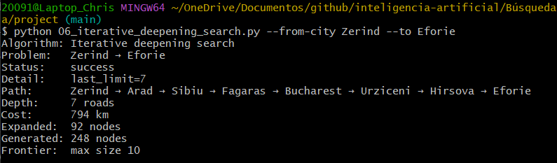

# Ejercicio 1: Comparar BFS, UCS, DFS, DLS e IDS en el mapa de Rumania

### Objetivo
Elegir una ruta distinta de Arad → Bucharest, ejecutar los algoritmos BFS, UCS, DFS, DLS e IDS, y analizar las diferencias en el camino encontrado, costo, profundidad y nodos expandidos.

### Pareja seleccionada
**Zerind → Eforie**

---

## Tabla comparativa de resultados

A continuación se presentan los algoritmos de búsqueda utilizados y los métricos obtenidos para la ruta **Zerind → Eforie**:

| Algoritmo | Status | Depth | Cost | Expanded | Generated | Path |
| :--- | :---: | :---: | :---: | :---: | :---: | :--- |
| **Breadth First Search (BFS)** | `Success` | 7 Roads | 794 km | 16 Nodes | 40 Nodes | Zerind → Arad → Sibiu → Fagaras → Bucharest → Urziceni → Hirsova → Eforie |
| **Uniform Cost Search (UCS)** | `Success` | 8 Roads | 762 km | 17 Nodes | 43 Nodes | Zerind → Arad → Sibiu → Rimnicu Vilcea → Pitesti → Bucharest → Urziceni → Hirsova → Eforie |
| **Depth First Search (DFS)** | `Failure / Loop` | N/A | N/A | 6 Nodes | 18 Nodes | N/A *(Sin éxito por bucle infinito)* |
| **DLS (limit 2)** | `Cutoff` | N/A | N/A | 3 Nodes | 8 Nodes | N/A |
| **DLS (limit 4)** | `Cutoff` | N/A | N/A | 13 Nodes | 35 Nodes | N/A |
| **DLS (limit 7)** | `Success` | 7 Roads | 794 km | 16 Nodes | 40 Nodes | Zerind → Arad → Sibiu → Fagaras → Bucharest → Urziceni → Hirsova → Eforie |
| **Iterative Deepening Search (IDS)** | `Success` | 7 Roads | 794 km | 92 Nodes | 248 Nodes | Zerind → Arad → Sibiu → Fagaras → Bucharest → Urziceni → Hirsova → Eforie |

---

## Diagramas ASCII de las rutas encontradas

***Diagrama de Ruta - BFS, DLS (limit 7) e IDS (Costo: 794 km)***
```text
[Zerind] ── 75 km ──> [Arad] ── 140 km ──> [Sibiu] ── 99 km ──> [Fagaras] ── 211 km ──> [Bucharest] ── 85 km ──> [Urziceni] ── 98 km ──> [Hirsova] ── 86 km ──> [Eforie]
```

***Diagrama de Ruta - Uniform Cost Search (Costo Óptimo: 762 km)***
```text
[Zerind] ── 75 km ──> [Arad] ── 140 km ──> [Sibiu] ── 80 km ──> [Rimnicu Vilcea] ── 97 km ──> [Pitesti] ── 101 km ──> [Bucharest] ── 85 km ──> [Urziceni] ── 98 km ──> [Hirsova] ── 86 km ──> [Eforie]
```

## Evidencia 
BFS



UCS



DFS



DLS LIMITED 2



DLS LIMITED 4



DLS LIMITED 7



IDS




