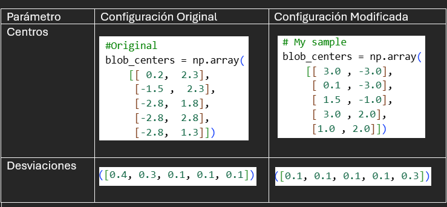
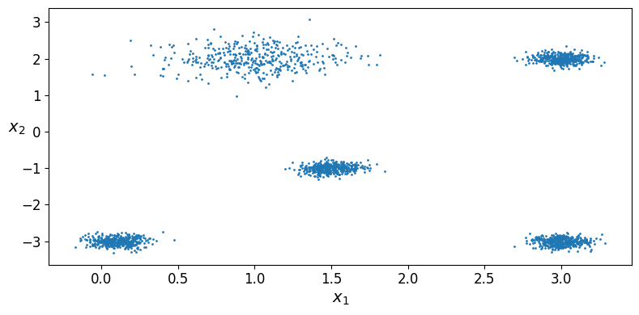
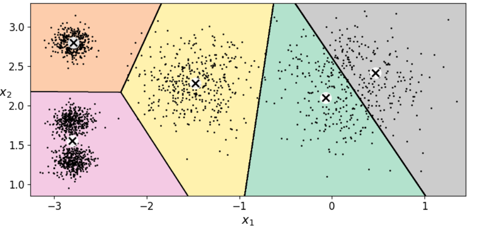
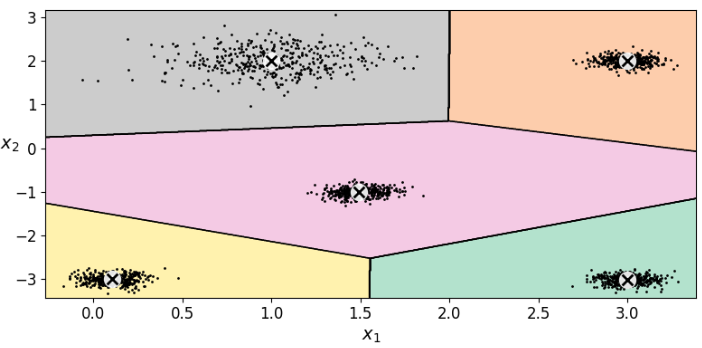
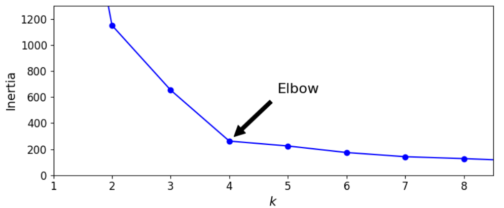
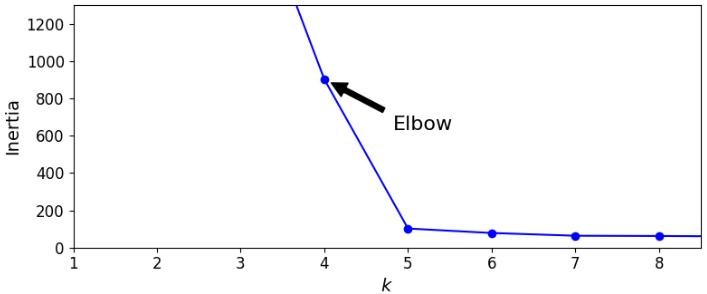
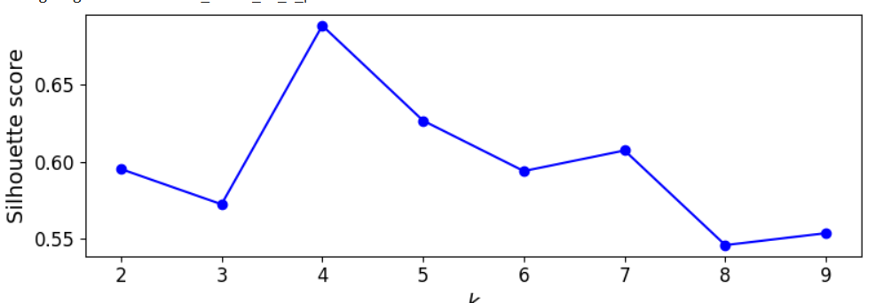
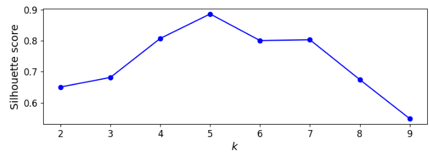

# Ejercicio 1- Separar los blobs y volver a elegir (k)


## Objetivo 

Correr la notebook en Colab tal como está, anotar el (k) que sugieren codo y silueta, separar los 5 blobs en el arreglo blob_centers (y, si hace falta, blob_std) y volver a graficar. Debes ver si el codo y la silueta se mueven hacia (k = 5).


## Link de Google Colab
```
https://colab.research.google.com/drive/1bJ1nv2zSXm094y49lImt5xYWAzQCNpC6?usp=sharing

```

## Parametros usados


### El esquema de cada unos de los casos se muestra de la siguiente manera:

### Original


### Con el esquema de centros y radios actualizado



## Resultados

### Valores de Inercia

* Inercia para  **(*k=3*)**
    - Original: 2090.166
    - Modificado: 2090.166

* Inercia para  **(*k=5*)**
    - Original: 102.25
    - Modificado: 102.25

* Inercia para  **(*k=8*)**
    - Original: 62.21
    - Modificado: 62.21


# Capturas de los diagramas generados

## Voronoi (k=5) 

### Original



### Modificado



## Codo y Silueta

### Codo

#### Original



#### Modificado



### Silueta

#### Original



#### Modificado




## Reporte
- **En los datos de Géron, ¿por qué el codo “prefiere” (k = 4) si make_blobs usó 5 centros?**

    Inicialmente el dataset fue generado con 5 centros. Pero durante el método del codo, el grafico de inercia sugiera un *k=4* como una opción optima.

    Esto se debe a que durante el ejercicio, las agrupaciones estan demasiado cerca. Para el algoritmo, los 2 blops se perciben como un unico clúster grande.

    Añadir un quinto clúster, no genera un cambio notable con respecto a uno de 4, el algoritmo busca minimizar la inercia  creando un codo en *k=4*. Si dos grupos son dificiles de distinguir, los agrupara en uno solo.


- **Con tus blobs separados, ¿el codo y la silueta coinciden en el mismo (k)? ¿Ese (k) es 5?**


    Con el metodo del codo, podemos observar que los valores de inercia tienen una mayor disminución en *k=5*, posteriormente la inercia es menos pronunciada.

    En el caso de la silueta, nos muestra un valor maximo en *k=5*, lo que nos indica clústeres mejor separados y más densos.

    Esa coincidencia de *k=5* radica en tener una configuración donde los centros se encuentran con suficiente separación hace que sean distinguibles.


- **Si el codo sigue en 4, ¿qué te falta mover (distancia entre centros vs. blob_std)?**

    Al usar una configuración de *k=4* la distancia entre los centros de los clusteres y la desviación no son suficientes.

    Por lo tanto es necesario aumentar la distancia entre los centros de los clusteres, sobretodo entre los clusteres de la parte de arriba del diagrama que genera que se agrupen en uno solo.

    Y por ultimo es necesario reducir la desviación estandar y hacer que cada blob sea más compacto, eso reduce la posibilidad que se sobre-pongan.


# Evidencia de google colab


