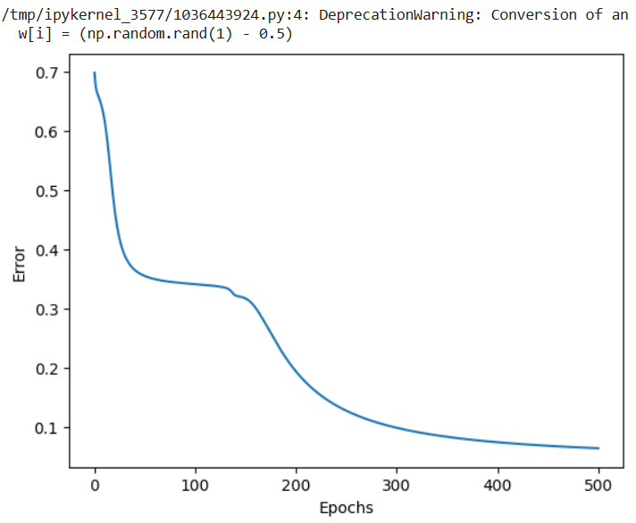
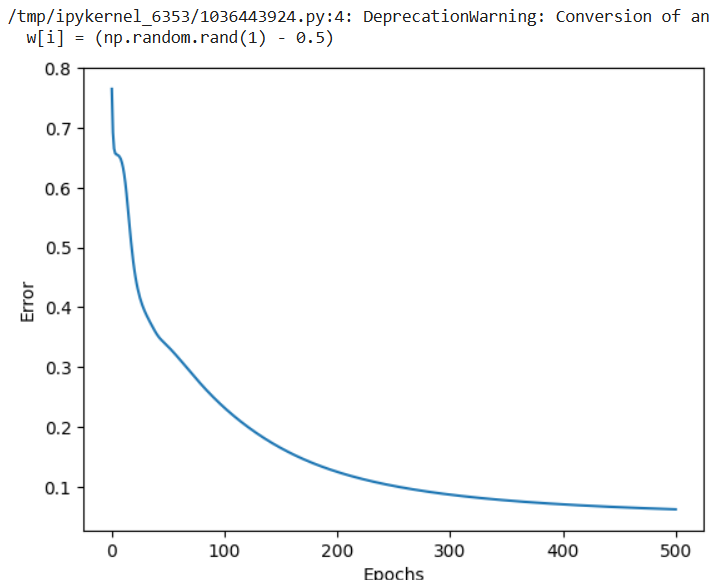
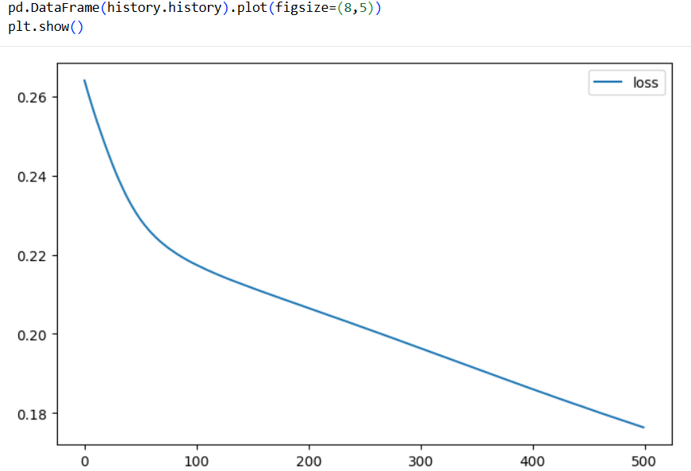
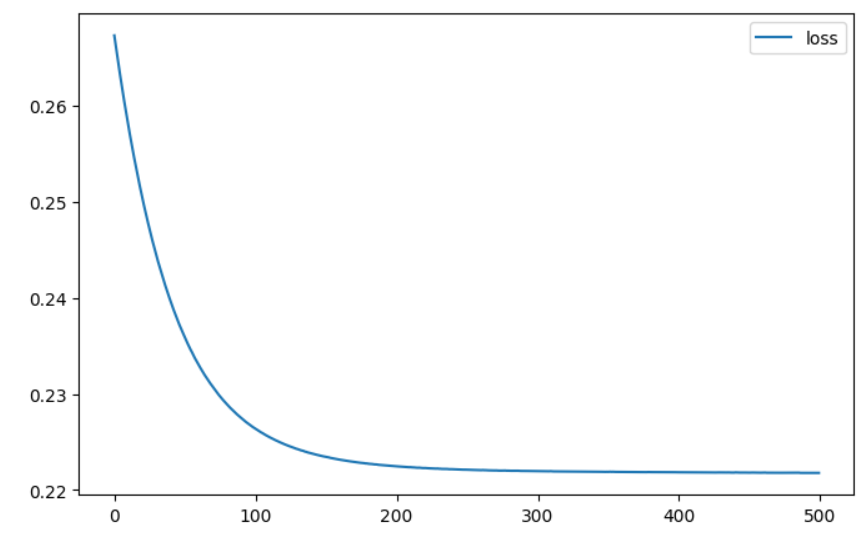

# Ejercicio 1 - Más capas en el perceptrón multicapa (IRIS)

## Objetivo 

```Texto
Correr ambas notebooks en Google Colab con la arquitectura original, agregar dos capas a cada red, volver a entrenar y comparar qué cambia (curva de error/pérdida, velocidad, calidad de la clasificación).`
```

## Links de las notebooks de Google Colab

Numpy Original
```
https://colab.research.google.com/drive/1fMM6lYyy2OYfaoIcB-du4Jy2iEKJVfyw?usp=sharing
```

Numpy Modificado
```
https://colab.research.google.com/drive/1qD5u0AFPP_sodEnHpN82mU3R_i_7_RAx?usp=sharing
```
Keras Original
```
https://colab.research.google.com/drive/1DIkD7BXbjxZSug_4M8OAYQbr56_V3EtD?usp=sharing
```

Keras Modificado
```
https://colab.research.google.com/drive/1J-zs1buX8YQNg3OZd_wTl0X7dJrEAe66?usp=sharing
```

Lo hice de esta forma para no esta ejecutando a cada rato entre la original y la modificada.

## Multilayer perceptron (Numpy)

En el siguiente apartado podremos observar como fue el comportamiennto entre los dos perceptron con diferente numero de capas.

Primero presentamos la captura del notebook original con la estructura de capas `4x3x3`

```#Topology: 4 x 3 x 3
input_size_layer1 = 4
num_neurons_layer1 = 3

input_size_layer2 = num_neurons_layer1
num_neurons_layer2 = 3

layer1 = list()
layer2 = list()
```

Lo que nos dió como resultado la siguiente curva de error.




Ahora como parte del ejercicio se cambio la arquitectura del perceptron, se cambió a la siguiente configuración de capas (4x3x3x3x3):

```
#Topology: 4 x 3 x 3 x 3 x 3
input_size_layer1 = 4 
num_neurons_layer1 = 3 

input_size_layer2 = num_neurons_layer1
num_neurons_layer2 = 3 

input_size_layer3 = num_neurons_layer2 
num_neurons_layer3 = 3 

input_size_layer4 = num_neurons_layer3 
num_neurons_layer4 = 3 

layer1 = list()
layer2 = list()
layer3 = list()
layer4 = list()

```



## Keras Multilayer

A continuación se presentan los resultados del algortimo usando Keras, donde igualmente se realizaron cambios a la arquitectura original.

```
model = keras.Sequential(
  [
    layers.Dense(3, activation="sigmoid", name="layer1", input_shape=(4,)),
    layers.Dense(3, activation="sigmoid", name="layer2"),
  ]
)

model.summary()

```
El resultado se muestra en el siguiente gráfico de perdida durante el entrenamiento.




Posteriormente se cambio la arquitectura del modelo, previamente contaba con 2 capas, ahora se agregó 1 más. La estructura del codigo se ve de la siguiente manera:

```
model = keras.Sequential(
  [
    layers.Dense(3, activation="sigmoid", name="layer1", input_shape=(4,)),
    layers.Dense(3, activation="sigmoid", name="layer2"),
    layers.Dense(3, activation="sigmoid", name="layer3"),
    layers.Dense(3, activation="sigmoid", name="layer4"),
  ]
)

model.summary()
```




## Reporte


* 1. ¿Bajar más el error al añadir dos capas, o se estancó / empeoró? ¿Igual en NumPy y en Keras?

    - En `Numpy`, original mente (2 capas), se incia el error en 0.70, posteriormente tiene una caida a 0.35 y luego vuelve a caer hasta un error final de menor a 0.1 en la epoca 500.

        Con 4 capas, inicia en 0.75, cae hacia 0.35 en la epoca 55 y sigue bajando hasta quedarse en menos de 0.1 igualmente.

        *En conclusión podemos decir que el error fue identico. El añadir 2 capas no tuvo un impacto positivo ni negativo en la reducción de la función del costo.*

    - En `Keras`, en el notebook original (2 capas) empieza en 0.26 y desciende hasta alcanzar alrededor de 0.18 en la epoca 500.

        Con 4 capas empieza igualmente en 0.26 y baja de manera suave hasta la epoca 200 y se aplana por completo en 0.22.

        *En conclusión en Keras con 4 capas la red se bloqueo en un errpr más alto 0.222 contra los 0.18 de las 2 capas.*
    

* 2. ¿Las curvas de la notebook 01 (NumPy) y de Keras se parecen con la misma topología? Diferencias de implementación.

    - No se parecen en la trayectoria ni en la magnitud del error. En Numpy el error desciende hasta valores por debajo de 0.07 mientras que en Keras el error se queda atascado arriba de 0.17 y 0.22.

    - En la forma de la curva Numpy tiene cambios mas bruscos mientras que en Keras se muestram curvas más suaves.

        Estas diferencias se pueden explicar por varios factores: 

    - La inicializacion de los pesos en Numpy, al usar la función ```np.random.rand(1) - 0.5 ``` generando una distribución uniforme de los valores de -0.5 a 0.5. Keras usa una función que calcula los pesos en base a la cantidad de entradas y salidas.

    - El tamaño del Batch Size, `numpy` usa la actualización de pesos patron por patron. En cambio Keras usa ``` batch_size = 32``` y optimizadores con tasa de aprendizaje adaptativa.

* 3. Con sigmoides apiladas y MSE, ¿tiene sentido que una red más profunda no aprenda mejor en Iris? Relación con las gráficas.

        Si, tiene sentido que no aprenda mejor debido a lo siguiente:

    - La derivada de la funcion sigmoide, al multiplicarla por si mismo en 4 capas, el gradiente se vuelve casi 0. El error desaparece antes de llegar a las primeras capas, lo que anula el aprendizaje.

    - En Keras con la arquitectura de 4 capas. se observa que la curva se vuelve plana entre las epocas 200 y 500, lo que significa que los pesos no cambian y la red deja de aprender.

    - Si la red se equivoca y la sigmoide ya dio valores cercanos a 0 y 1. el error MSE no genera lo suficiente para corregir los pesos dejando a la red atascada. 


## Evidencia

