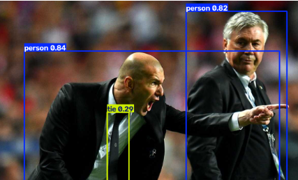
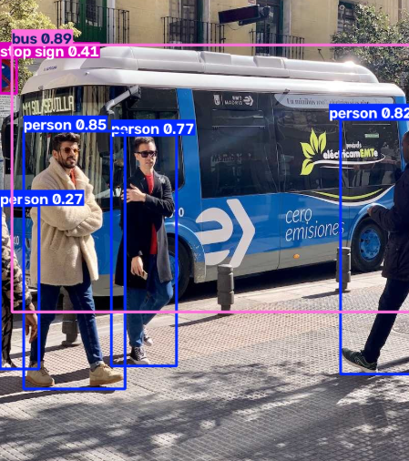
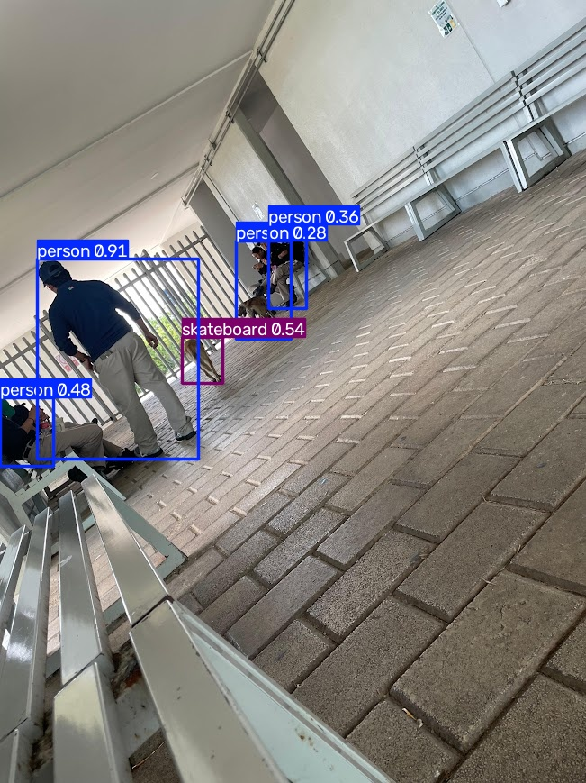
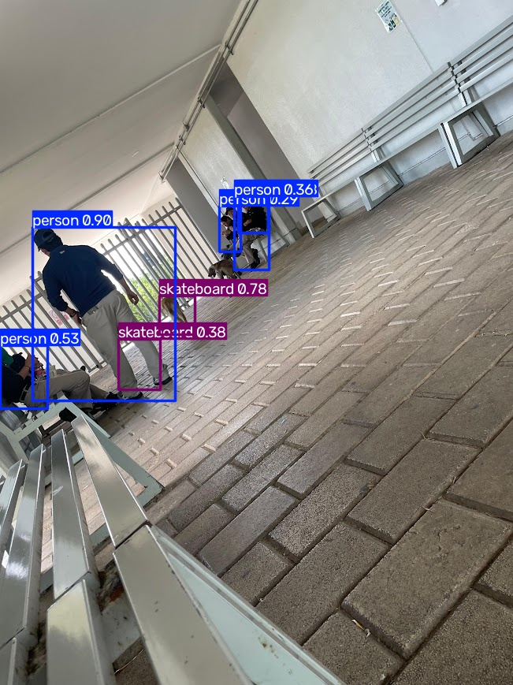

# Ejercicio 1 — Cambiar la imagen de predicción en YOLO

## Objetivo 
```Texto
Correr la notebook en Colab tal como está, sustituir las dos imágenes de muestra por una imagen tuya (la misma en ambas predicciones) y comparar qué objetos detecta YOLO en la foto original frente a la tuya.

```

## Enlace de Colab
```Texto
https://colab.research.google.com/drive/1-7MU-Jt15FFBNYHvx5X9HtycabJ7u9ou?usp=sharing
```

## Capturas de Salida de Zidane y del Bus

Primera detección de Zidane



Segunda detección de Buses



## Capturas de mis imagenes







## Reporte

Durante el ejercicio se pudieron detectar diferentes clases en cada una de las imágenes usadas para la detección y predicción.

En la primera prueba, con las imágenes que la notebook tenía originalmente, se detectaron dos clases: persona y corbata.

En la segunda, se detectaron tres clases: persona, autobús y señal de alto.

Por último, en la prueba con imágenes propias, en la primera se detectaron dos clases: persona y skateboard. Cabe señalar que el objeto era en realidad un perro, por lo que la probabilidad detectada de que fuera un skateboard fue de apenas un 50 %. Esto podría deberse a la posición del objeto en la imagen, lo que dificultó su detección y provocó que la predicción no fuera del todo correcta, considerando además que "perro" es una clase muy común en los datasets de entrenamiento.

Al final, al comparar los resultados, podemos darnos cuenta de que la celda de detección fue más errónea, ya que la probabilidad asignada a skateboard fue mucho más alta que en la predicción.


## Evidencias.

